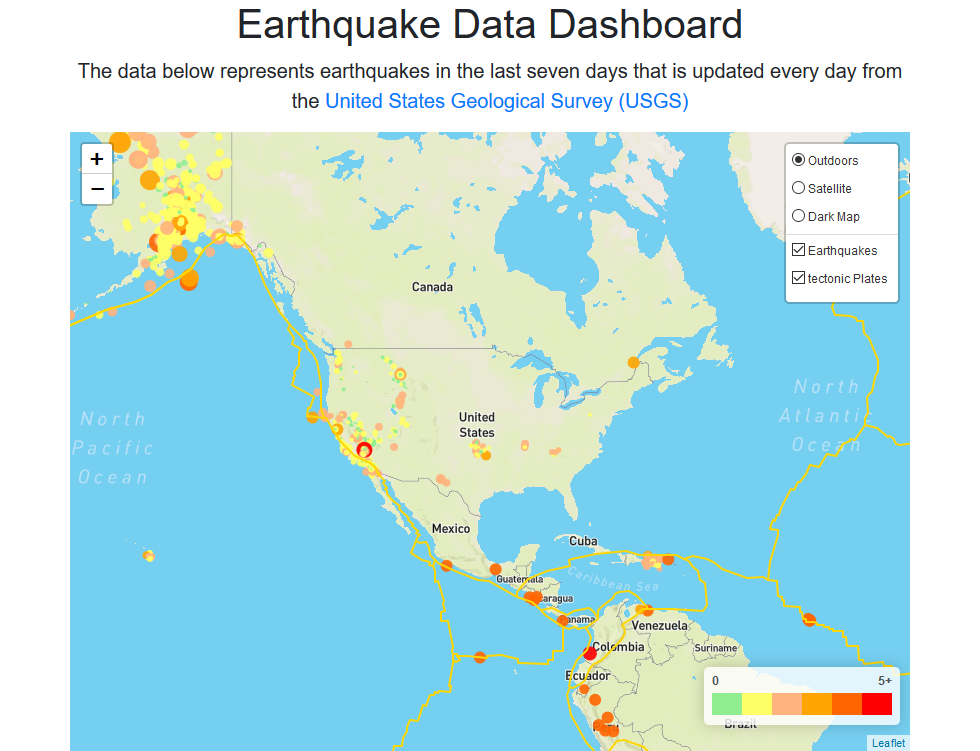

# Earthquake Visualization
* Visualizing the last seven days of US earthquake date using USGS GeoJSON and Leaflet to create the map

## Check the final application screenshot

## Check the final application
https://fawnzou.github.io/Leaflet_Earthquake/
